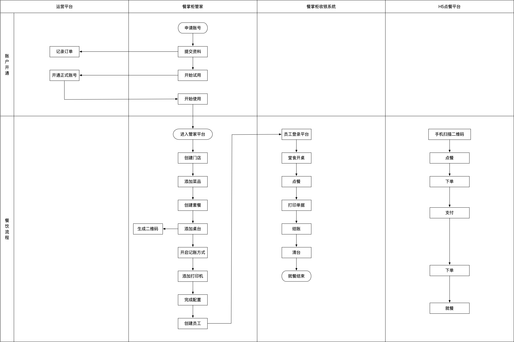
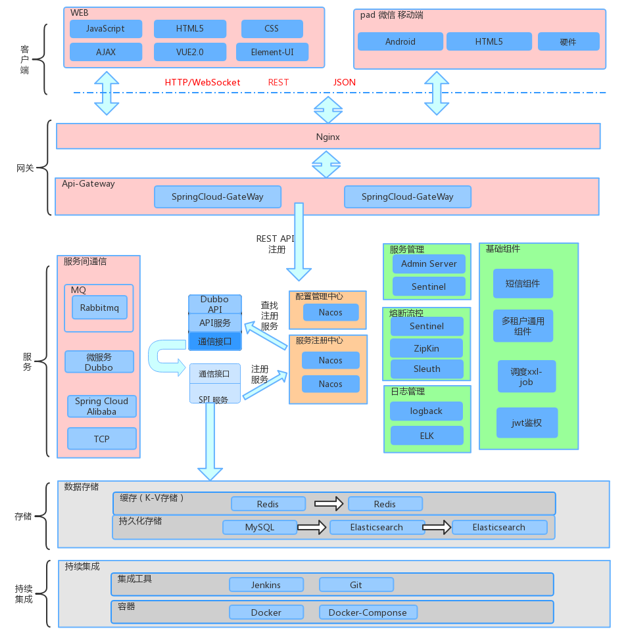
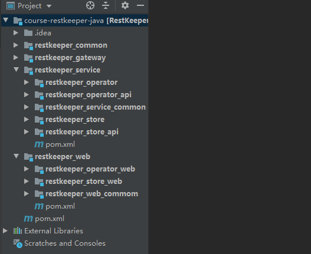
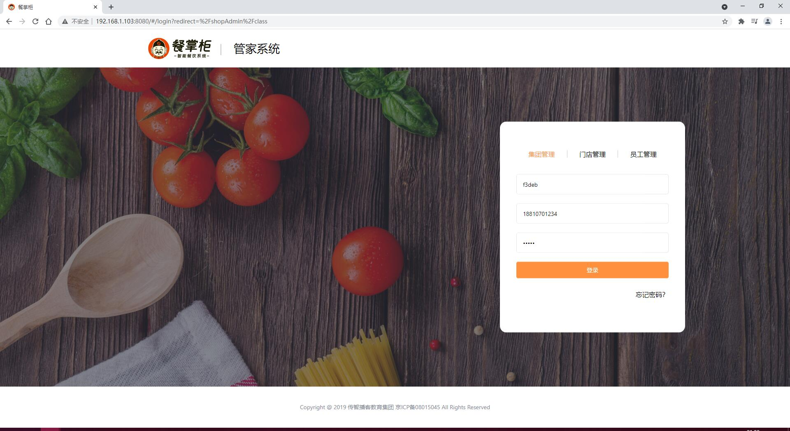
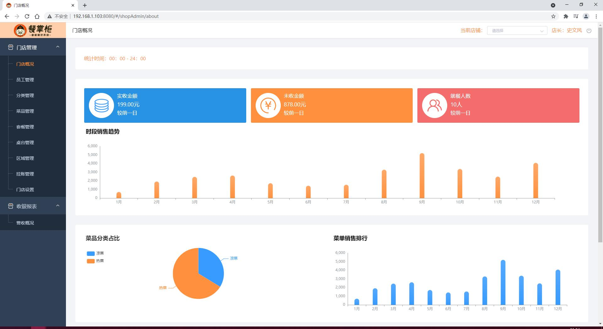
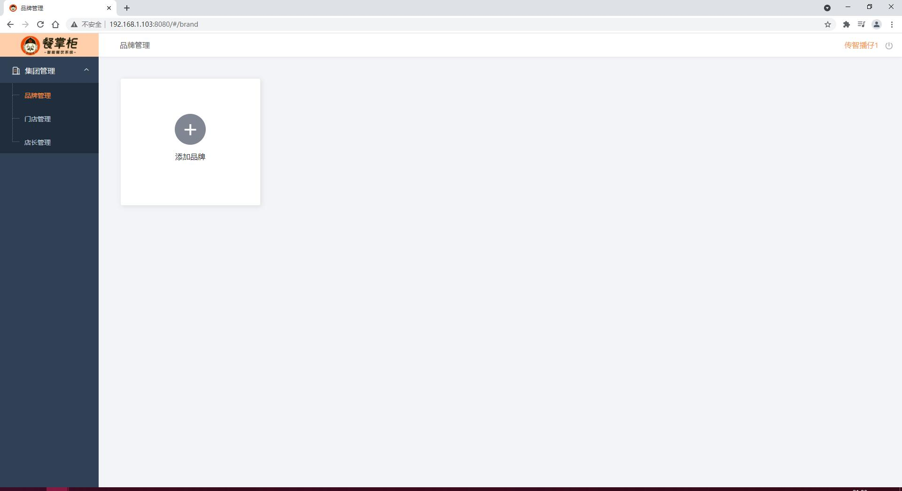
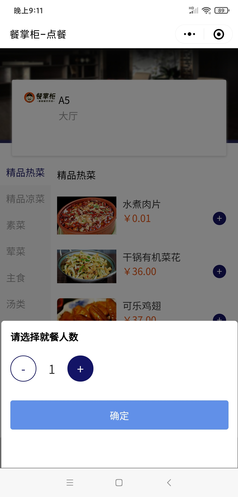
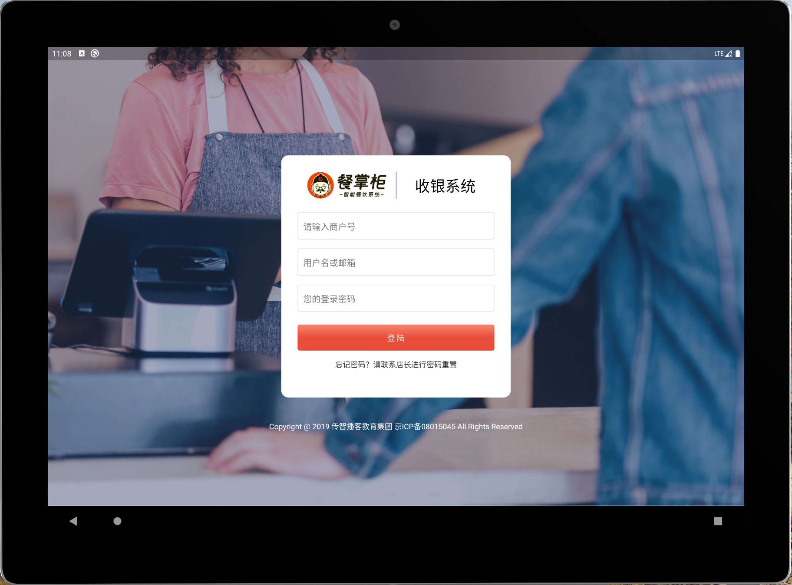
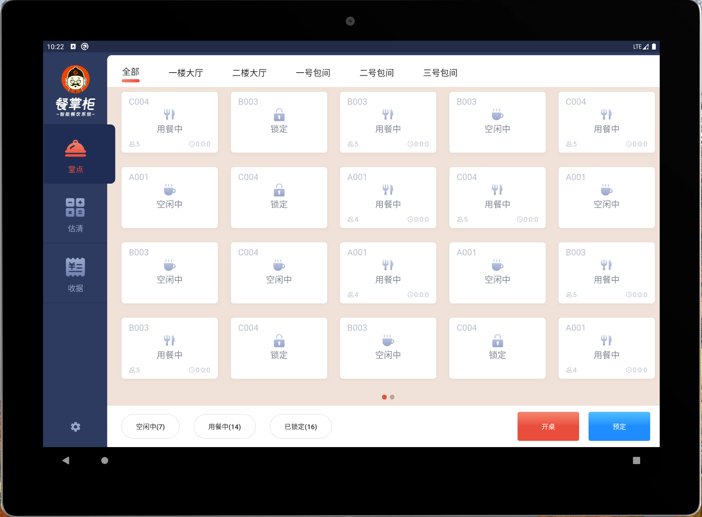

# 🍽️ 餐掌柜 RestKeeper 智能餐饮管理系统

 餐掌柜 RestKeeper 是由传智播客研究院研发的智慧餐饮 SaaS 服务及运营平台，致力于为餐饮集团或门店提供全套互联网化、智能化的收银与管理解决方案。

 
 
 
 
 
 
 
<a href="https://springfox.github.io/springfox/" target="_blank"> 

---

## 📌 一、项目简介

餐掌柜 RestKeeper 是一款面向餐饮行业的智能化 SaaS 管理系统，集成了点餐、收银、会员管理、移动支付等核心功能，适用于餐饮企业从单店到连锁集团的多种业务场景。

随着餐饮行业数字化转型加速，传统线下管理模式已无法满足高效运营和用户体验的需求。本项目应运而生，通过线上平台帮助商家实现统一管理、多端协同、数据可视化的经营目标，提升运营效率和服务质量。

## 🔗 在线体验

🔗 [在线体验地址](https://pip.itcast.cn/eatManager)

## 💻 前端工程

📱 [Gitee 前端仓库地址](https://gitee.com/itxinfei/restkeeper-front)

---

## 🧩 二、系统模块

系统由四大子系统组成，覆盖商户端、员工端、用户端以及运营后台，提供全方位的餐饮服务支持：

| 子系统名称             | 主要功能描述 |
|----------------------|-------------|
| 平台运营中心系统       | 账号管理、订单中心、平台配置、支付中心等 |
| 餐掌柜管家系统         | 商家入驻后使用的管理后台，支持区域桌台配置、菜品分类、人员管理、统计分析等；支持集团管理 |
| 餐掌柜收银系统         | 收银员操作界面，支持堂食点餐、结算等功能，兼容安卓 / iOS 设备 |
| 餐掌柜 H5 点餐系统     | 用户扫码即可进入点餐页面，完成下单与支付流程 |

---

## 🔄 三、核心业务流程

### 1. 商户入驻流程

餐掌柜支持两种入驻方式：**自主申请开通** 和 **运营后台手动开通**

#### 自主提交流程：

1. 商家在餐掌柜管家端填写资料并提交；
2. 运营中心记录信息并生成账号（含餐厅编号、登录账号、有效期）；
3. 向商家发送短信通知，提示账号开通成功；
4. 商家登录后系统自动检测是否到期，并作出相应提示。

#### 后台开通流程：

1. 运营人员在平台后台填写餐厅信息并保存；
2. 自动生成账号信息并通过短信通知商家；
3. 商家登录后系统验证账号有效性并提示使用状态。

### 2. 主线业务流程

1. 商家申请账号并提交资料；
2. 运营中心开通账号并短信通知；
3. 商家试用结束后可申请正式账号继续使用；
4. 登录管家端配置门店、菜品、桌台二维码、打印机等；
5. 添加员工并分配权限；
6. 员工登录员工端进行开桌、点餐、打印、结账、清台等操作；
7. 客户扫码点餐、下单、支付，实现全流程自助化。

---

## ⚙️ 四、技术架构

系统采用 **Spring Cloud 微服务架构**，结合 Nacos 注册中心、Sentinel 流量控制、Redis 缓存、MySQL 分库分表等技术，构建了一个高并发、高可用、易扩展的企业级系统。

---

## 📁 五、工程结构说明

### 1. 后端工程结构

| 模块名称          | 功能说明               |
|------------------|------------------------|
| common            | 公共工具类与基础组件   |
| gateway           | 系统网关模块           |
| service (父工程)  | 微服务业务层           |
| operator          | 运营端业务模块         |
| operator_api      | 运营端接口资源模块     |
| service_common    | 服务层公共依赖模块     |
| web (父工程)      | 表现层（Controller）模块 |
| operator_web      | 运营端表现层模块       |
| web_common        | 表现层公共依赖模块     |

### 2. 前端工程结构

前端采用 Vue3 + TypeScript 开发，适配 PC 端、移动端及小程序端，具备良好的响应式布局和交互体验。

---

## 📸 六、项目截图

### 1. 餐掌柜后台系统

### 2. 门店管理模块

### 3. 集团管理模块

### 4. 微信小程序端

### 5. 安卓 APP 界面

---

## 🏗️ 七、项目部署（后期更新）

该项目支持本地部署、云端部署等多种方式，后续将逐步完善部署文档与自动化部署脚本，敬请期待。

### 🔗 项目链接 & 社区支持  
  
🚀 项目地址：[https://gitee.com/itxinfei/restkeeper](https://gitee.com/itxinfei/restkeeper)  
👥 QQ交流群：[661543188](https://qm.qq.com/cgi-bin/qm/qr?k=gNgch-wCkfUu-QbI7DZSudrax2BN7vY0&jump_from=webapi&authKey=QHSRnxQvu+h5S3AXGn/DSHrVPiFQAYEk6bSlCE1lS276SFjQAUagV4FG7bHf0OSM)  
📧 邮箱支持：[747011882@qq.com](http://mail.qq.com/cgi-bin/qm_share?t=qm_mailme&email=f0hLSE9OTkdHTT8ODlEcEBI)  

