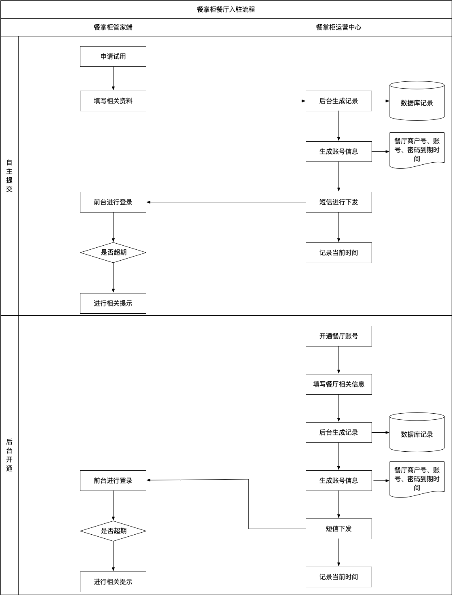
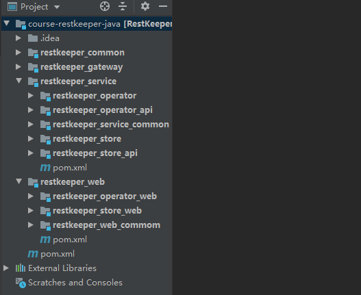

前端工程（不公开）：https://gitee.com/itxinfei/restkeeper-front

### 一、项目简介
餐掌柜智能餐饮管理系统（简称餐掌柜 RestKeeper）是由传智播客研究院研发的智慧餐饮SaaS服务及运营平台，主要为餐饮集团或门店提供全套的互联网智能化收银、管理相关解决方案。主要功能包括点餐、收银、会员管理、移动支付等。

### 二、系统模块

餐掌柜由平台运营中心系统、餐掌柜管家系统、餐掌柜收银系统、餐掌柜H5点餐系统组成，为商户及用户提供全方位的用餐服务。

（1）平台运营中心系统 即运营方的管理中心，主要包含账号管理、订单中心、平台配置、支付中心等功能。

（2）餐掌柜管家系统 商家入驻平台后，可以通过餐掌柜管家端管理和配置系统的基本信息，如区域桌台配置、菜品分类配置、人员配置、统计分析等。管家端支持集团管理功能，商家可以通过集团管理员账号登录系统来管理分店信息。

（3）餐掌柜收银系统 收银员用于收银结算使用的系统，可以运行在安卓或IOS系统上。主要功能包括堂点、收银等功能。

（4）餐掌柜H5点餐系统

### 三、核心业务流程

#### 1、账号开通及申请流程

对于商家申请入驻，餐掌柜提供了两种模式，分别是：用户自主开通，运营后台开通。具体入驻流程如下图所示：

#### 2、自主提交

1）商家在餐掌柜管家端申请试用，并填写相关资料信息。

2）信息被提交到餐掌柜运营中心进行记录生成并存入数据库中进行记录。

3）运营中心生产商家相关帐号信息，包括：餐厅商户号、帐号、密码到期时间。

4）向商家发送开通成功短信通知，并记录当前时间。

5）商家在管家端进行登录，在登录过程中会判断当前商家帐号是否到期，并作出相关提示。

#### 3、后台开通

1）餐掌柜后台运营人员在运营端为商家开通帐号，填写相关餐厅信息并保存到数据库中进行保存。

2）为商家生成帐号信息，短信通知商家并记录当前时间。

3）商家在管家端进行登录，在登录过程中会判断当前商家帐号是否到期，并作出相关提示。

#### 4、主线业务流程

1）商家在餐掌柜管家端申请帐号并提交资料到餐掌柜运营端。

2）餐掌柜运营端记录本次订单信息，开通帐号并短信通知商家。

3）商家接收短信，并开始试用。

4）当试用到期，商家可以选择向运营端申请开通正式帐号，当开通了正式帐号之后，商家可以继续使用。

5）商家可以在管家端进入管家平台，然后创建门店、添加菜品、常见套餐、添加桌台并为每一个桌台生成唯一二维码、开启并设置记账方式、添加打印机并保存配置信息。

6）商家在管家端添加员工并分配帐号信息。员工就可以登录员工平台。

7）员工可以在员工平台中，为每一桌客人进行堂食开桌、点餐、打印单据、结账、清台。

8）客人可以用手机扫描二维码进行点餐、下单、支付等操作。

### 四、技术架构

### 五、工程结构

餐掌柜工程代码

### 六、工程说明：

| 工程模块名称          | 作用           |
| :-------------------- | :------------- |
| common                | 公共模块       |
| gateway               | 网关模块       |
| service（二级父工程） | 微服务业务层   |
| operator              | 运营端业务模块 |
| operator_api          | 运营端资源模块 |
| service_common        | 业务层公共模块 |
| web（二级父工程）     | 微服务表现层   |
| operator_web          | 运营端表现模块 |
| web_common            | 表现层公共模块 |
